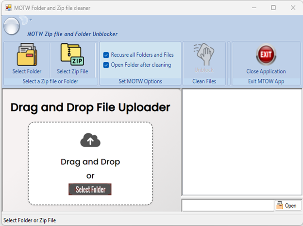
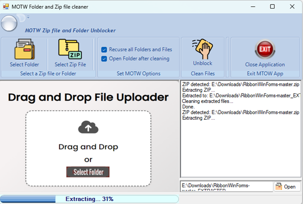

# MOTW Cleaner

MOTW app — Windows Mark of the Web Cleaner (Drag. Drop. Done.) Folder & ZIP File MOTW  Cleaner — Media Kit 2026
Version 1.0
“Remove Windows Mark of the Web security blocks instantly. Drag. Drop. Done.”

Prepared by Dwain Snickles
April 2026

About MOTW app
What is MOTW app?
MOTW app is a lightweight Windows desktop utility that removes the “Mark of the Web” (MOTW) security flag from downloaded files and folders. When Windows downloads files from the internet or extracts ZIP archives, it attaches a hidden MOTW attribute that blocks execution, triggers security warnings, and prevents normal file use. MOTW app strips these flags with a single click or drag-and-drop, saving time and frustration for developers, IT professionals, and power users alike.
The Problem
Every file downloaded from the internet or extracted from a ZIP archive receives a hidden Zone.Identifier alternate data stream — the Mark of the Web. This seemingly invisible tag creates real, tangible friction:
●	Files downloaded from the internet are marked with Zone.Identifier alternate data streams that flag them as potentially unsafe
●	Extracted ZIP archives carry MOTW flags on every single file inside the archive
●	Developers frequently encounter blocked .dll, .resx, .exe, and project files that refuse to load or compile
●	Manually unblocking files one-by-one through the Windows Properties dialog is tedious, error-prone, and impractical for large file sets
●	Forgotten MOTW flags cause mysterious build failures, runtime errors, and security prompts that waste valuable development time
The Solution
MOTW app eliminates this problem entirely with a clean, purpose-built interface that handles files individually or in bulk:
●	One-click batch unblocking of entire folder trees — hundreds or thousands of files cleaned in seconds
●	Automatic ZIP extraction with simultaneous MOTW cleaning — extract and unblock in one step
●	Recursive folder/file processing with a single checkbox — reach every nested subdirectory
●	Drag-and-drop interface for instant file cleaning — no menus, no configuration
●	Real-time progress bar and detailed activity log — always know what’s happening
●	Auto-open cleaned folders after processing — jump straight into your work

💡 How It Works
Drag a folder or ZIP file onto MOTW app → It scans and removes all Zone.Identifier alternate data streams → Your files are fully unblocked and ready to use. That’s it. Drag. Drop. Done.

Key Features

Feature	Description
Drag & Drop Uploader	Drop any folder or ZIP file directly onto the app window to begin cleaning instantly
Select Folder Button	Browse and select any folder on your system for MOTW cleaning
Select ZIP File Button	Choose a ZIP archive to extract and clean in a single operation
Recurse All Folders	Toggle recursive processing to clean every file in every subdirectory
Open After Cleaning	Automatically opens the target folder in Explorer after the operation completes
Live Progress Bar	Real-time visual feedback during ZIP extraction and file processing
Operation Log Panel	Detailed, scrollable log of every action taken — see exactly what was cleaned

Use Cases
●	Developers downloading GitHub repositories, NuGet packages, or SDKs that arrive with MOTW flags blocking compilation
●	IT Administrators deploying software packages across enterprise machines where blocked files cause installation failures
●	Power Users managing large batches of downloads from browsers, cloud storage, or email attachments
●	Anyone tired of right-clicking Properties → Unblock on every single file, one at a time
System Requirements

Operating System	Windows 10 or later
Runtime	.NET 4.72 Runtime

Screenshots & Workflow Gallery
The following screenshots illustrate MOTW app’s complete workflow — from the initial interface, through the problem it solves, the cleaning process, and the verified result.
1. Ready to Clean
 
Figure 1: The MOTW app main interface features a clean, intuitive layout with drag-and-drop support, folder/ZIP selection buttons, and configurable options for recursive processing.

2. Extraction in Progress

 
Figure 3: MOTW app automatically extracts ZIP archives and cleans MOTW flags simultaneously, with a real-time progress bar showing extraction status at 31%.
3. Cleaning Complete 
Figure 4: The operation log confirms the full workflow: ZIP detected, extracted, cleaned, and done. All MOTW flags have been removed from every file in the archive.

4. Verified: M2. The Problem: MOTW Security Block
 
Figure 2: A typical file properties dialog showing the Mark of the Web security warning: “This file came from another computer and might be blocked to help protect this computer.” This is the tedious manual process MOTW app eliminates.

❗ The Manual Way
Without MOTW app, users must open the Properties dialog for every single file, scroll to the security section, check the “Unblock” box, and click OK. For a ZIP with hundreds of files, this can take hours. MOTW app does it in seconds.

5) MOTW Flag Removed
 
Figure 5: After MOTW app processing, the same file’s properties dialog no longer shows any MOTW security warning — the file is fully unblocked and ready to use.

✅ Before & After
Compare Figures 2 and 5 above: the security block warning disappears completely after MOTWapp processing. No manual intervention, no Properties dialogs, no forgotten files.

Brand Guidelines
App Name
The app name is written as MOTW app — always as one word. “MOTW” appears in uppercase and “app” in lowercase. Never write it as “MOTW App,” “Motw app,” “Motw App,” or any other variation.
Color Palette

Color Name	Hex Code	Swatch	Usage
Primary Blue	#1E78C8	██████	Headings, buttons, “app” in logo, primary UI accents
Accent Orange	#FFA500	██████	Folder icon, highlights, call-to-action elements, dividers
Dark Navy	#141E37	██████	“MOTW” in logo, dark backgrounds, section headers
White	#FFFFFF	██████	Page background, text on dark backgrounds, clean space

Typography
Recommended UI Font: Segoe UI (Windows system font) for the application interface. Marketing materials and documentation may use Calibri or Calibri Light for body text with Candara or Corbel for display headings.
Logo Description
The MOTW app logo features a folder icon rendered in an orange-to-blue gradient, with a white paintbrush/cleaning brush overlay representing the “cleaning” action performed on file folders. The folder shape conveys file management, while the brush communicates the app’s core purpose: sweeping away MOTW flags.
Tagline
“Drag. Drop. Done.”
Tone of Voice
●	Professional — Credible and trustworthy; suitable for developer audiences
●	Developer-Friendly — Speaks the language of the technical community
●	Efficient — Values the user’s time; messaging is concise and action-oriented
●	No-Nonsense — Clear, direct communication without hype or jargon inflation

Quick Facts

Item	Detail
App Name	MOTW app
Full Name	MOTW Folder and ZIP File Cleaner
Platform	Windows 10+
Framework	.NET 4.72, WinForms
Author	Dwain Snickles
License	To be determined
Tagline	Drag. Drop. Done.

Contact

Developer	Dwain Snickles
Location	Tennessee, USA

For press inquiries, collaboration opportunities, or app store listing requests, please reach out to the developer directly.

MOTW app
Drag. Drop. Done.
© 2026 Dwain Snickles. All rights reserved.
